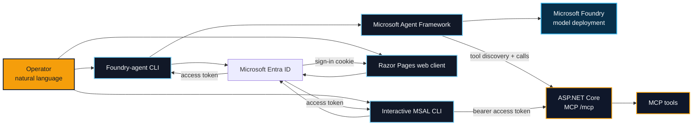

<div align="center">

# MCP / ENTRA / FOUNDRY

### A protected, stateless .NET 10 MCP server with CLI and web-client demos

[](https://dotnet.microsoft.com/download/dotnet/10.0)
[](https://learn.microsoft.com/azure/foundry/agents/how-to/tools/model-context-protocol)
[](#system-contract)
[](#02--configure-microsoft-entra-id)

**Protect MCP tools with Microsoft Entra ID. Discover them from CLI, Foundry-agent, and web-client demos.**

</div>

---

## System contract

| Signal | Value |
| --- | --- |
| MCP endpoint | `http://localhost:7777/mcp` |
| Transport | Streamable HTTP, stateless |
| Protocol header | `MCP-Protocol-Version: 2025-11-25` |
| Included tools | `get_random_number`, `generate_random_persons` |
| Agent runtime | Microsoft Agent Framework + Microsoft Foundry |
| MCP API protection | Microsoft Entra ID bearer access token required |
| OAuth discovery | `/.well-known/oauth-protected-resource` and `/.well-known/oauth-authorization-server` |
| Client demos | Foundry-agent CLI, interactive MSAL CLI, Razor Pages web client |

> [!IMPORTANT]
> `/mcp` requires a valid Microsoft Entra access token. The server validates authentication, but its current authorization configuration requires only an authenticated user. Add named scope or app-role policies before using the sample as a production authorization model.

## Architecture



The server exposes anonymous health and OAuth metadata endpoints, and protects `/mcp` with ASP.NET Core authentication and authorization middleware. The Foundry-agent CLI obtains an MCP token through `DefaultAzureCredential`, discovers tools, and supplies them to a Foundry-backed agent. The interactive CLI uses MSAL to obtain a delegated token directly. The Razor Pages demo signs a user in with Microsoft Entra ID; its MCP discovery and AI chat services currently return simulated data.

## What is included

| Project | Demo | Integration status |
| --- | --- | --- |
| `McpEntra.MCP.Basic` | Entra-protected Streamable HTTP MCP server, OAuth metadata, health endpoint, and sample tools | Live |
| `McpEntra.MCP.CliClient` | Foundry agent that discovers and calls MCP tools with `DefaultAzureCredential` | Live |
| `McpEntra.MCP.ClientOBO` | Interactive MSAL client that lists protected MCP tools | Live; the project name is retained, but its current flow is interactive delegated sign-in rather than an OBO exchange |
| `McpEntra.MCP.WebClient` | Entra-protected Razor Pages MCP workspace and AI-chat UI | UI and sign-in are implemented; MCP and AI service calls are simulated |

## Quickstart

### 01 / Prerequisites

- [.NET 10 SDK](https://dotnet.microsoft.com/download/dotnet/10.0)
- [Azure CLI](https://learn.microsoft.com/cli/azure/install-azure-cli)
- A Microsoft Entra tenant where you can create or configure app registrations
- For the Foundry-agent CLI: a [Microsoft Foundry project](https://learn.microsoft.com/azure/foundry/how-to/create-projects) and model deployment

Authenticate locally:

```powershell
az login
```

`DefaultAzureCredential` uses the available developer credential. See the official [.NET authentication guidance](https://learn.microsoft.com/dotnet/api/azure.identity.defaultazurecredential?view=azure-dotnet).

### 02 / Configure Microsoft Entra ID

Create or identify an **API app registration** for `McpEntra.MCP.Basic`:

1. Record its **Application (client) ID** and **Directory (tenant) ID**.
2. Under **Expose an API**, add the delegated scope `MCP.Access`. The resulting scope is `api://<api-app-id>/MCP.Access`.
3. Give every client that calls the MCP endpoint delegated permission to that scope. Grant tenant-wide consent when your tenant requires it.

Create the client registrations that match the demos you will run:

| Demo | App registration | Required configuration |
| --- | --- | --- |
| Foundry-agent CLI | A developer identity authenticated by Azure CLI or another `DefaultAzureCredential` source | Its identity must have consent for `api://<api-app-id>/MCP.Access`. |
| Interactive CLI | Public/native client | Add `http://localhost` as a mobile and desktop redirect URI. Record its client ID. |
| Web client | Confidential web application | Add the exact local or deployed `https://<host>/signin-oidc` redirect URI. Create a client secret or use a certificate and store it outside source control. Record its client ID. The current simulated services do not request the MCP scope. |

The MCP server publishes its resource metadata at `/.well-known/oauth-protected-resource`; the advertised scope is derived from the API app's client ID. Keep the exposed scope name as `MCP.Access` so that discovery metadata, the server, and clients use one contract.

### 03 / Restore and build

Run commands from the repository root:

```powershell
dotnet restore "src\McpEntra\McpEntra.slnx"
dotnet build "src\McpEntra\McpEntra.slnx" --configuration Release
```

### 04 / Configure and start the MCP server

Set the API app registration values without committing them. For a local PowerShell session:

```powershell
$env:AzureAd__TenantId = "<tenant-id>"
$env:AzureAd__ClientId = "<api-app-id>"
```

Alternatively, replace the placeholders in `McpEntra.MCP.Basic\appsettings.json` only in a non-committed local copy. The API registration must expose `MCP.Access`.

```powershell
dotnet run --project "src\McpEntra\McpEntra.MCP.Basic\McpEntra.MCP.Basic.csproj" --urls http://localhost:7777
```

The stateless MCP endpoint is now available at:

```text
http://localhost:7777/mcp
```

`GET /health` and the two `/.well-known` endpoints are anonymous. All MCP JSON-RPC calls require `Authorization: Bearer <access-token>`.

### 05 / Run the Foundry-agent CLI

Open a second terminal and set:

```powershell
$env:MCP_URL = "http://localhost:7777/mcp"
$env:MCP_API_ENDPOINT = "api://<api-app-id>/.default"
$env:MCP_DEPLOYMENT_NAME = "<deployment-name>"
$env:AZURE_AI_PROJECT_ENDPOINT = "https://<resource>.services.ai.azure.com/api/projects/<project>"
```

| Variable | Purpose |
| --- | --- |
| `MCP_URL` | Streamable HTTP endpoint exposed by the local server |
| `MCP_API_ENDPOINT` | Token scope requested by `DefaultAzureCredential`; set to `api://<api-app-id>/.default` |
| `MCP_DEPLOYMENT_NAME` | Name of the model deployment used by the agent |
| `AZURE_AI_PROJECT_ENDPOINT` | Project endpoint copied from the Foundry portal |

### 05 / Run the agent

```powershell
dotnet run --project "src\McpEntra\McpEntra.MCP.CliClient\McpEntra.MCP.CliClient.csproj"
```

Try a prompt such as:

```text
Generate a random number between 20 and 40.
```

The CLI lists discovered MCP tools at startup. Enter `exit` or press <kbd>Ctrl</kbd> + <kbd>C</kbd> to stop.

### 06 / Run the interactive authenticated CLI

This demo uses MSAL interactive sign-in and only lists the MCP tools. It requires the public-client registration from the Entra configuration step.

```powershell
$env:MCP_URL = "http://localhost:7777/mcp"
$env:CLIENT_ID = "<native-client-app-id>"
$env:MCP_CLIENT_ID = "<api-app-id>"
$env:TENANT_ID = "<tenant-id>"

dotnet run --project "src\McpEntra\McpEntra.MCP.ClientOBO\McpEntra.MCP.ClientOBO.csproj"
```

The client requests `api://<api-app-id>/MCP.Access`, opens the system browser for sign-in, and sends the returned access token to the MCP endpoint.

### 07 / Run the web-client demo

The web project binds `AzureAd`, `Mcp`, and `AI` settings. Configure a web-app registration and values before starting it:

```powershell
$env:AzureAd__TenantId = "<tenant-id>"
$env:AzureAd__ClientId = "<web-client-app-id>"
$env:Mcp__BaseUrl = "http://localhost:7777/mcp"
$env:Mcp__McpApiUrl = "api://<api-app-id>/MCP.Access"
$env:AI__DeploymentName = "<deployment-name>"
$env:AI__ProjectUrl = "https://<resource>.services.ai.azure.com/api/projects/<project>"

dotnet run --project "src\McpEntra\McpEntra.MCP.WebClient\McpEntra.MCP.WebClient.csproj" --urls https://localhost:5001
```

Register `https://localhost:5001/signin-oidc` in the web-client app registration when using the command above. Use the equivalent public HTTPS URL after deployment.

The web client uses a system-assigned managed identity as a certificate-less client credential. Enable that identity on the Azure host and add a federated credential to the web-client app registration with issuer `https://login.microsoftonline.com/<tenant-id>/v2.0`, the managed identity principal ID as its subject, and audience `api://AzureADTokenExchange`. For a user-assigned managed identity, set `AzureAd__ClientCredentials__0__ManagedIdentityClientId` to that identity's client ID.

> [!NOTE]
> The web client acquires a delegated token for `Mcp:McpApiUrl` and calls the configured MCP endpoint to discover its tools. `ChatService` returns a simulated response and does not call the Foundry project yet.

## Call the MCP server directly

### REST Client file

Open [`src\McpEntra\McpEntra.MCP.Basic\HttpCalls\Bearer.http`](src/McpEntra/McpEntra.MCP.Basic/HttpCalls/Bearer.http), define the local URL and a valid access token in its private environment file, then run the included request from Visual Studio or VS Code with a REST client extension. Do not add tokens to the tracked `.http` file.

### PowerShell

```powershell
$token = az account get-access-token `
    --scope "api://<api-app-id>/MCP.Access" `
    --query accessToken `
    --output tsv

$body = @{
    jsonrpc = "2.0"
    id = 1
    method = "tools/call"
    params = @{
        name = "get_random_number"
        arguments = @{
            min = 20
            max = 40
        }
    }
} | ConvertTo-Json -Depth 5

Invoke-WebRequest `
    -Uri "http://localhost:7777/mcp" `
    -Method Post `
    -Headers @{
        Accept = "application/json, text/event-stream"
        Authorization = "Bearer $token"
        "MCP-Protocol-Version" = "2025-11-25"
    } `
    -ContentType "application/json" `
    -Body $body
```

Tool methods are exposed as snake_case MCP names: `GetRandomNumber` becomes `get_random_number`, and `GenerateRandomPersons` becomes `generate_random_persons`.

## Project map

```text
src\McpEntra
├── McpEntra.MCP.Basic
│   ├── Program.cs              Protected MCP registration, metadata, and /mcp endpoint
│   ├── Tools
│   │   ├── RandomNumberTools.cs
│   │   └── ProtectedServiceTools.cs
│   └── HttpCalls
│       ├── Basic.http          Unauthenticated request shape reference
│       └── Bearer.http         Authenticated request template
├── McpEntra.MCP.CliClient
│   └── Program.cs              Tool discovery and Foundry agent loop
├── McpEntra.MCP.ClientOBO
│   └── Program.cs              Interactive MSAL MCP tool discovery
└── McpEntra.MCP.WebClient
    ├── Pages                  Entra-protected Razor Pages UI
    └── Services               Current simulated MCP and AI integrations
```

To add a tool:

1. Create an internal tool class under `McpEntra.MCP.Basic\Tools`.
2. Add `[McpServerTool]` to each callable public instance method.
3. Add `[Description]` metadata to the method and every exposed parameter.
4. Register the class explicitly with `.WithTools<T>()` in `Program.cs`.

## Quality and publishing

Verify formatting:

```powershell
dotnet format "src\McpEntra\McpEntra.slnx" --verify-no-changes --no-restore
```

Publish the server as a self-contained, single-file executable by selecting one configured runtime identifier:

```powershell
dotnet publish "src\McpEntra\McpEntra.MCP.Basic\McpEntra.MCP.Basic.csproj" `
    --configuration Release `
    --runtime win-x64
```

Configured targets include Windows, macOS, glibc Linux, and musl Linux variants.

### Build a container in Azure Container Registry

The Dockerfile uses `src\McpEntra\McpEntra.MCP.Basic` as its build context. Run the ACR build from the repository root:

```powershell
az acr build `
    --registry <registry-name> `
    --image mcp-entra:latest `
    --file Dockerfile `
    "src\McpEntra\McpEntra.MCP.Basic"
```

## Official documentation

| Topic | Microsoft documentation |
| --- | --- |
| Connect Foundry agents to MCP servers | [Model Context Protocol tool](https://learn.microsoft.com/azure/foundry/agents/how-to/tools/model-context-protocol) |
| Build Foundry agents with .NET | [Microsoft Foundry Agent Service](https://learn.microsoft.com/agent-framework/integrations/by-component/agent-services/foundry) |
| Create an `AIProjectClient` | [Azure AI Projects client library for .NET](https://learn.microsoft.com/dotnet/api/overview/azure/ai.projects-readme?view=azure-dotnet#key-concepts) |
| Register and configure an API | [Protected web API app registration](https://learn.microsoft.com/entra/identity-platform/scenario-protected-web-api-app-registration) |
| Expose a delegated API scope | [Expose scopes in a protected web API](https://learn.microsoft.com/entra/identity-platform/scenario-protected-web-api-expose-scopes) |
| Configure a web application | [Web app app registration](https://learn.microsoft.com/entra/identity-platform/scenario-web-app-sign-user-app-registration) |
| Sign in a desktop application | [Desktop app app registration](https://learn.microsoft.com/entra/identity-platform/scenario-desktop-app-registration) |
| Configure authorization policies | [Implement authorization with Microsoft.Identity.Web](https://learn.microsoft.com/entra/msidweb/authentication/authorization) |
| Protect APIs with least privilege | [Protect APIs with least privilege](https://learn.microsoft.com/security/zero-trust/develop/protect-api) |
| ASP.NET Core fundamentals | [ASP.NET Core fundamentals overview](https://learn.microsoft.com/aspnet/core/fundamentals/?view=aspnetcore-10.0) |
| Microsoft Learn MCP server | [Learn MCP Server overview](https://learn.microsoft.com/training/support/mcp) |
