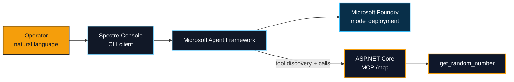

<div align="center">

# MCP / ENTRA / FOUNDRY

### A stateless .NET 10 MCP server wired into a Microsoft Foundry agent

[](https://dotnet.microsoft.com/download/dotnet/10.0)
[](https://learn.microsoft.com/azure/foundry/agents/how-to/tools/model-context-protocol)
[](#system-contract)
[](#entra-id-roadmap)

**Discover tools. Attach them to an agent. Call them with natural language or raw JSON-RPC.**

</div>

---

## System contract

| Signal | Value |
| --- | --- |
| MCP endpoint | `http://localhost:7777/mcp` |
| Transport | Streamable HTTP, stateless |
| Protocol header | `MCP-Protocol-Version: 2025-11-25` |
| Included tool | `get_random_number` |
| Agent runtime | Microsoft Agent Framework + Microsoft Foundry |
| Local authentication | `DefaultAzureCredential` after `az login` |
| MCP API protection | **Not implemented yet** |

> [!IMPORTANT]
> The server and agent integration are runnable today. Despite the repository name, Microsoft Entra ID authentication and authorization are still a planned layer; the `/mcp` endpoint is currently anonymous.

## Architecture



The CLI connects to the MCP server, discovers its tools, and supplies those tools to an agent backed by a Foundry model deployment. The agent decides when a prompt should invoke an MCP tool and returns the result to the terminal.

## Quickstart

### 01 / Prerequisites

- [.NET 10 SDK](https://dotnet.microsoft.com/download/dotnet/10.0)
- [Azure CLI](https://learn.microsoft.com/cli/azure/install-azure-cli)
- A [Microsoft Foundry project](https://learn.microsoft.com/azure/foundry/how-to/create-projects)
- A model deployment in that project

Authenticate locally:

```powershell
az login
```

`DefaultAzureCredential` uses the available developer credential. See the official [.NET authentication guidance](https://learn.microsoft.com/dotnet/api/azure.identity.defaultazurecredential?view=azure-dotnet).

### 02 / Restore and build

Run commands from the repository root:

```powershell
dotnet restore "src\McpEntra\McpEntra.slnx"
dotnet build "src\McpEntra\McpEntra.slnx" --configuration Release
```

### 03 / Start the MCP server

```powershell
dotnet run --project "src\McpEntra\McpEntra.MCP.Basic\McpEntra.MCP.Basic.csproj" --urls http://localhost:7777
```

The stateless MCP endpoint is now available at:

```text
http://localhost:7777/mcp
```

### 04 / Configure the CLI

Open a second terminal and set:

```powershell
$env:MCP_URL = "http://localhost:7777/mcp"
$env:MCP_DEPLOYMENT_NAME = "<deployment-name>"
$env:AZURE_AI_PROJECT_ENDPOINT = "https://<resource>.services.ai.azure.com/api/projects/<project>"
```

| Variable | Purpose |
| --- | --- |
| `MCP_URL` | Streamable HTTP endpoint exposed by the local server |
| `MCP_DEPLOYMENT_NAME` | Name of the model deployment used by the agent |
| `AZURE_AI_PROJECT_ENDPOINT` | Project endpoint copied from the Foundry portal |

### 05 / Run the agent

```powershell
dotnet run --project "src\McpEntra\McpEntra.MCP.CliClient\McpEntra.MCP.CliClient.csproj"
```

Try a prompt such as:

```text
Generate a random number between 20 and 40.
```

The CLI lists discovered MCP tools at startup. Enter `exit` or press <kbd>Ctrl</kbd> + <kbd>C</kbd> to stop.

## Call the MCP server directly

### REST Client file

Open [`src\McpEntra\McpEntra.MCP.Basic\HttpCalls\Basic.http`](src/McpEntra/McpEntra.MCP.Basic/HttpCalls/Basic.http), define:

```http
@url = http://localhost:7777
```

Then run the included `tools/call` request from Visual Studio or VS Code with a REST client extension.

### PowerShell

```powershell
$body = @{
    jsonrpc = "2.0"
    id = 1
    method = "tools/call"
    params = @{
        name = "get_random_number"
        arguments = @{
            min = 20
            max = 40
        }
    }
} | ConvertTo-Json -Depth 5

Invoke-WebRequest `
    -Uri "http://localhost:7777/mcp" `
    -Method Post `
    -Headers @{
        Accept = "application/json, text/event-stream"
        "MCP-Protocol-Version" = "2025-11-25"
    } `
    -ContentType "application/json" `
    -Body $body
```

Tool methods are exposed as snake_case MCP names: `GetRandomNumber` becomes `get_random_number`.

## Project map

```text
src\McpEntra
├── McpEntra.MCP.Basic
│   ├── Program.cs              MCP registration and /mcp endpoint
│   ├── Tools
│   │   └── RandomNumberTools.cs
│   └── HttpCalls
│       └── Basic.http          Executable JSON-RPC request
└── McpEntra.MCP.CliClient
    └── Program.cs              Tool discovery and Foundry agent loop
```

To add a tool:

1. Create an internal tool class under `McpEntra.MCP.Basic\Tools`.
2. Add `[McpServerTool]` to each callable public instance method.
3. Add `[Description]` metadata to the method and every exposed parameter.
4. Register the class explicitly with `.WithTools<T>()` in `Program.cs`.

## Quality and publishing

Verify formatting:

```powershell
dotnet format "src\McpEntra\McpEntra.slnx" --verify-no-changes --no-restore
```

Publish the server as a self-contained, single-file executable by selecting one configured runtime identifier:

```powershell
dotnet publish "src\McpEntra\McpEntra.MCP.Basic\McpEntra.MCP.Basic.csproj" `
    --configuration Release `
    --runtime win-x64
```

Configured targets include Windows, macOS, glibc Linux, and musl Linux variants.

### Build a container in Azure Container Registry

The Dockerfile uses `src\McpEntra\McpEntra.MCP.Basic` as its build context. Run the ACR build from the repository root:

```powershell
az acr build `
    --registry <registry-name> `
    --image mcp-entra:latest `
    --file Dockerfile `
    "src\McpEntra\McpEntra.MCP.Basic"
```

## Entra ID roadmap

The intended destination is an Azure-hosted MCP API protected by Microsoft Entra ID:

```text
Native CLI -- authorization code + PKCE --> Microsoft Entra ID
Native CLI -- bearer access token ------> protected /mcp endpoint
MCP API    -- scope / app-role policy ---> authorized tools
```

The security layer should:

- validate token signature, issuer, audience, and lifetime;
- enforce delegated scopes or application roles through ASP.NET Core authorization policies;
- treat the CLI as a public native client with no embedded secret;
- keep tenant IDs, client IDs, audiences, and scopes in configuration;
- use managed identity for Azure-hosted workloads where applicable.

Follow Microsoft's official guidance:

- [Build and secure an ASP.NET Core web API with Microsoft Entra ID](https://learn.microsoft.com/entra/identity-platform/tutorial-web-api-dotnet-core-build-app)
- [Expose scopes in a protected web API](https://learn.microsoft.com/entra/identity-platform/scenario-protected-web-api-expose-scopes)
- [Implement authorization with Microsoft.Identity.Web](https://learn.microsoft.com/entra/msidweb/authentication/authorization)
- [Protect APIs with least privilege](https://learn.microsoft.com/security/zero-trust/develop/protect-api)

## Official documentation

| Topic | Microsoft documentation |
| --- | --- |
| Connect Foundry agents to MCP servers | [Model Context Protocol tool](https://learn.microsoft.com/azure/foundry/agents/how-to/tools/model-context-protocol) |
| Build Foundry agents with .NET | [Microsoft Foundry Agent Service](https://learn.microsoft.com/agent-framework/integrations/by-component/agent-services/foundry) |
| Create an `AIProjectClient` | [Azure AI Projects client library for .NET](https://learn.microsoft.com/dotnet/api/overview/azure/ai.projects-readme?view=azure-dotnet#key-concepts) |
| ASP.NET Core fundamentals | [ASP.NET Core fundamentals overview](https://learn.microsoft.com/aspnet/core/fundamentals/?view=aspnetcore-10.0) |
| Microsoft Learn MCP server | [Learn MCP Server overview](https://learn.microsoft.com/training/support/mcp) |
